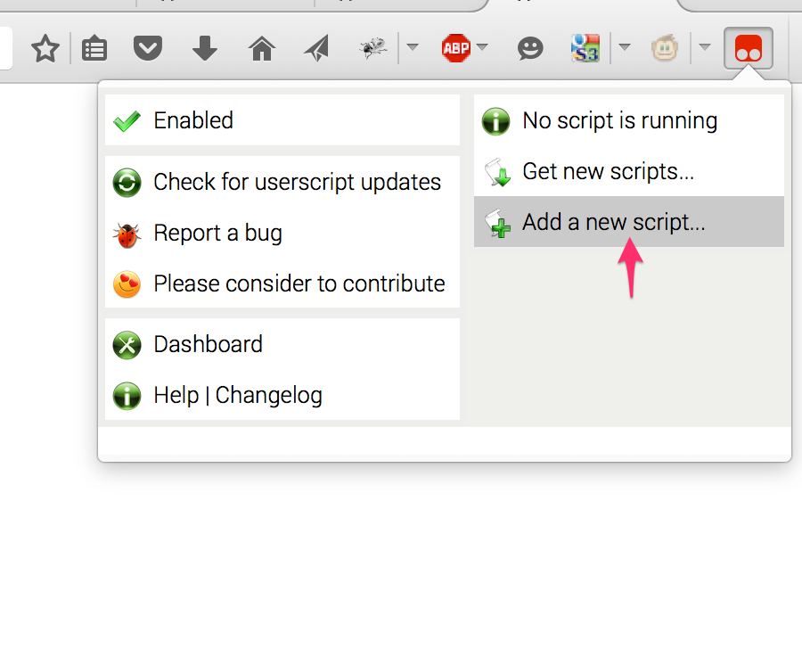

# Apigee UE Tampermonkey script to Filter policy list

This is a [Tampermonkey](https://tampermonkey.net/) script that tweaks the
[Apigee](https://apigee.com) UI to allow the user to filter the list of
policies displayed in the policy picker. 

## What is Tampermonkey?

Tampermonkey is a browser extension, that works on Firefox, Chrome, Safari,
etc. It is a pre-requisite to get this tweak of the Edge UI.

Tampermonkey allows the running of "user scripts" on webpages from particular
domains. It's a way of augmenting or modifying the behavior of a webpage, using
code provided by or approved by the user. The modification could be as simple as
changing the color or styling of a webpage; or it could be as complex as adding
new behavior or UI elements on a web page, or even adding new pages.

The user must install the custom script, and associate it to a particular domain
or set of domains. Thereafter, all pages loaded from those domains will run that
"user script" after the browser page has loaded.

## How does this Tweak work?

This script registers for apigee.com . When it finds that the current page
displays the proxy editor, it adds an event listener to each of the three "add
policy" buttons. This event listener is a bit of JavaScript that updates
the HTML DOM after the pagfe displays the policy picker.

## Installing the script

If you don't have Tampermonkey loaded for your browser, you must first visit
[tampermonkey.net](https://tampermonkey.net/) and install it.

Then,

1. Use the tampermonkey menu to add a new script.
   

2. copy-paste the [filter-policy-list.user.js](lib/filter-policy-list.user.js) script into place.

3. Reload the browser tab that is displaying the Proxies list.

4. Done.

## License

This user script is licensed under the [Apache 2.0 license](LICENSE).

## Compatibility

This user script works with Firefox, and Chrome on MacOS X.
It *ought to* work just fine on other combinations of browsers.

## Bugs

??

